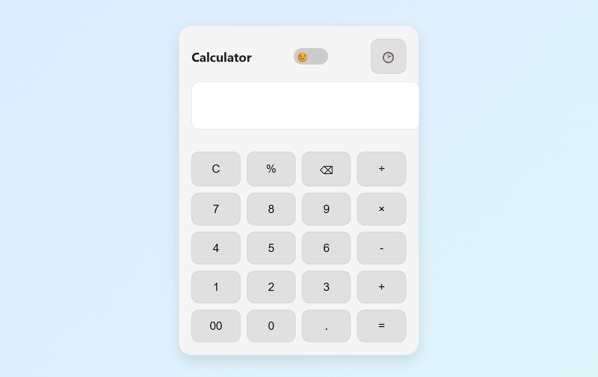
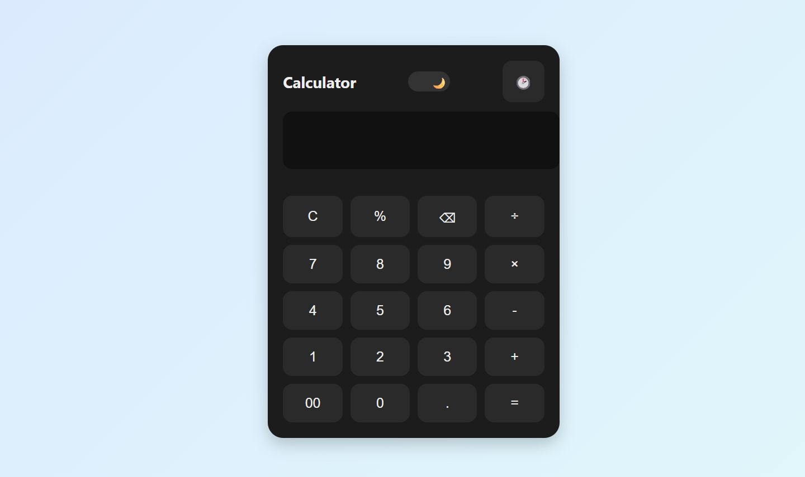

# 🧮 Modern Calculator  

A **responsive, minimal, and interactive Calculator Web App** built using **HTML, CSS, and JavaScript**.  
It comes with **Dark/Light themes**, **calculation history**, and a smooth **modern UI**.  

---

## 🚀 Live Demo  

🔗 [Try it here](https://kunal-web3.github.io/OIBSIP-Calculator/)  

---

## 🛠️ Tech Stack  

- **HTML5** – structure  
- **CSS3** – styling & themes  
- **JavaScript (ES6)** – logic & interactivity  

---

## 📂 Project Structure  

OIBSIP-Calculator/

├── index.html # Main HTML file  
├── style.css # Stylesheet (themes, layout, UI)  
├── script.js # Calculator logic & theme toggle  
├── screenshot.png # Project preview  
└── README.md # Project documentation  

---

## 📸 Preview  

### 🌞 Light Mode & Dark Mode Caculator
 
  

 

---

## ✨ Features  

- ➕ Perform basic arithmetic operations (+, −, ×, ÷, %)  
- 🌗 **Dark/Light theme toggle** for a personalized experience  
- 📝 **History panel** – view previous calculations  
- 🧹 Options to **clear all** or **clear last digit**  
- 📱 Fully **responsive** & works across devices  
- 🎨 Modern design with **subtle animations**  

---

## 🎯 Learning Outcomes  

Through this project, I practiced:  
- Implementing **theme switching** with JavaScript & CSS variables  
- Handling **dynamic UI updates** and DOM manipulation  
- Building a **responsive UI** with CSS Grid & Flexbox  

---

## 🙌 Acknowledgements

Special thanks to **Oasis Infobyte (OIBSIP)** for the opportunity and guidance.  

---

## 📢 Connect with Me  

🔗 [LinkedIn](https://www.linkedin.com/in/kunal-jadhav-kj) | 🌐 [GitHub](https://github.com/kunal-web3)

